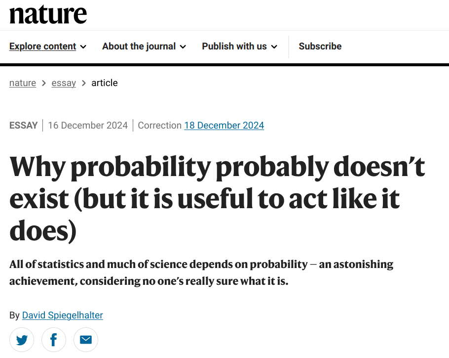
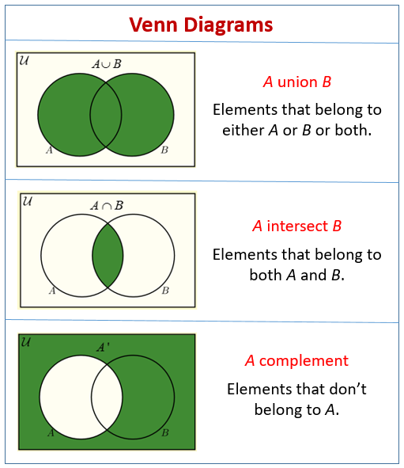

```{r setup, include=FALSE}
```


```{r setup, include=FALSE}
knitr::opts_chunk$set(echo = FALSE, warning = FALSE, message = FALSE)
library("plotrix")
```

## Class Structure

This class is an introduction to Statistics and Regression models. 

You will learn about 

- foundamental probability theory
- statistics for simple and multiple regression
- advanced regression models (logistic, ridge, LASSO, time series, mixed effect)
- tutorials for statistical coding in R or Python

## Coding Preference

Which coding language you are most comfortable with?
R/Python/Matlab/SASS

Which coding language you want to learn the most?
R/Python


## Class Expectations
The class will have two parts. The first part will be lecture based, and the second part will be workshop based. 

Students are expected to:

 1. take notes from lectures
 2. submit assignment
 3. take mid-term exam
 4. complete a final data analysis project with R or Python. 
 
## Class Expectations

This class will be a little bit intense, if you do not have a lot of background in statistics and statistical coding. But I will keep it casual as possible. 

You can ask for a 3 days delay of your assignment and 1 week delay of your final project, but ask before the deadline. 

After assignment grading, you will have an opportunity to revise-resubmit-regrade. 

Mid-term exam grades will be curved. 

## Class Expectations

You are encouraged to 

- work on your own research project and data for the final project
- schedule office hour with me to ask class materials or your research statistical analysis

## Textbook
*Regression Analysis by Example Using R. (6th edition)  John Wiley & Sons., ISBN: 978-1-119-83087-0*

*Statistics. William Hays., ISBN: 978-0030744679. https://archive.org/details/statisticsfifthe00will*

## Deliverables

- Assignment<br>
<font size="4">Assignment will be problems to solve or coding problems.</font><br>
- Mid-term Exam<br>
<font size="4">Mid-term exam will multiple choice questions and problems testing your understanding of course materials.</font><br>
- Final Project<br>
<font size="4">You are expected to use R or Python to develope a final project. Details will be disclosed later.</font>


## Questions?


## Elementary Probability Theory

What is probability? 

Ex. *"The probability of head when we toss a coin."*


## Probability

What is probability? 

Probability is to put a number to quantify the **"Uncertainty"** or **"Chance"** of possible outcomes of a random process, such as:

- tomorrow's weather
- winner of a sports game
- price of a stock after an hour

## Uncertainty

Our world is uncertain. 

- *Will my paper be accepted?*
- *What will be your final grade in this class?*
- *Will my investment profit or loss?*
- *Who will be our next president?*

## Probability might no exist

Why?


## Probability might no exist



## Probability might no exist

- Probability measures ignorance or uncertainty in people's mind, not the actual probability.

<font size="5">Ex. If I cover a coin in my hand, and ask you what is the probability of this coin being head. </font><br>


- Our macroscopic world is deterministic.
- Probability is a thought model for us to interpret and predict the uncertain world.

*All models are wrong, but some are useful.*

## Simple Experiment

A simple experiment is some well-defined act or process in real or conceptual that leads to a single well-defined outcome. 

1. Tossing a coin
2. Drawing a card from a deck of cards
3. Measuring a participants' political orientation.


## Sample space

- The set of all possible outcomes of an idealized simple experiment is the sample space for the experiment. 

For each of the following experiment, what is their sample space?

1. Tossing a coin
2. Drawing a card from a deck of cards
3. Measuring a participants' political orientation.

## Elementary event

- Any member of the sample space is called a sample point, or an elementary event. 
- Any set of the elementary events is called an event. 

Events are **Sets** of elementary event. 

## Events Example
Simple Experiment: Drawing a random card from a shuffled deck of cards.<br>

Elementary event: Any individual card in this deck of cards, such as spade 9 or heard 5

Event: 

- Card with number 5 (a set of four elementary events)
- Card of spade (a set of 13 elementary events)
- Spade 9 or heart 5 (a set of 2 elementary events)
- No card (a set of null or 0 elementary event)

## Events as sets of possibilities

Notation: 

- Sample space: $S$
- Events: $E, A, B$ etc.
- Events are subsets of sample space: $A \subseteq S$, $B \subseteq S$
- $S$ can be finite or infinite<br>

Rolling a dice: $S = \{H, T\}$<br>
Rolling two dices: $S = \{HH, HT, TH, TT\}$<br>
Drawing a card: $S = \{S1, S2, ..., H1, H2, ...\}$<br>
Reading a temperature meter: $S = [-20, 100]$ suppose there is bounds of this meter

## Events as sets of possibilities

        
- $S$ itself can be an event

The sample space is bound to occur. 

Rolling a dice, it must be either head or tail. 

Reading a meter, it must be a real number between -20 and 100. 
 
- Event $\emptyset$ is called null event or impossible event. It is an empty set. 

## Operations of events
1. Interaction ($\cap$)

A **and** B $\Rightarrow A \cap B$

2. Union ($\cup$)

A **or** B $\Rightarrow A \cup B$

3. complement ($A^c$)

**not** A $\Rightarrow A^c$

It means events in $S$ that does not contain any elementary events in $A$

## Venn Diagram

We can draw a Venn Diagram to represents the sets and their operations.





## Exercise

Now draw a Venn diagram of

$$B \cap A^c$$
This set can also be written as $B \backslash A$. It is similar to a minus operation. 


## Special relationship among events

- Mutually exclusive

$$A \cap B = \emptyset$$
There is no shared element between A and B. 

Example:

1. $A =$ Draw a card with number 5
2. $B =$ Draw a card with number 9

Draw the Venn diagram.

## Special relationship among events

- Exhaustive

$$A \cup B = S$$
The elements in A or B takes the entire sample space.

Example:

- $A =$ Draw a card with even number
- $B =$ Draw a card with odd number

Draw the Venn Diagram.

## Probabilities

Probabilities are numbers assigned to each and every event in some sample space. 

$P(A) =$ probabilities of event A

Example:

- Probability of drawing a card with number 4
- Probability of head in a coin toss
- Probability of drawing a card with heart

The elementary events are mutually exclusive and exhuastive. 

## Some Axioms

- $P(A) \geq 0$

Probabilities is larger or equal to 0.

- $P(S) = 1$

Probability of sample space is 1. 

- $P(A_1 \cup A_2 \cup ... \cup A_N) = P(A_1) + P(A_2) + ... + P(A_N)$

The probability of the mutually exclusive events are the sum of their probabilities. 

## Rule of probabilities

1. Rule of complementary probability

$$P(A^C) = 1-P(A)$$
2. Rule of probability range

$$0 \leq P(A) \leq 1$$
3. Rule of impossible event

$$P(\emptyset) = 0$$
4. "Or" rule of probability

$$P(A \cup B) = P(A) + P(B) - P(A \cap B)$$

## Rule of probabilities

5. Partition rule

If a set of events $\{A, B, ...,L\}$ are mutually exclusive and exhaustive

$$P(A \cup B \cup...\cup L)=P(A)+P(B)+...+P(L)=1$$

## Find probabilities

How do we find the probabilities of events?

In a conceptual simple experiment, we may assume the elementary events have equal probabilities. 

Drawing a card from a deck of cards.

$$P(Heart 4)=P(Spade 9)$$

Every pair of elementary events are mutually exclusive, thus a probability of a event A is the sum of probabilities of all elementary events in A. 

$$P(4) = P(Heart 4) + P(Club 4) + P(Spade 4) + P(Diamond 4)$$

## Find probabilities

In this case, we can calculate the probability of an event by counting its elementary events.

$$P(A) = \frac{N_A}{N}$$ 
$N_A =$ number of elementary events in event $A$. 

$N =$ number of elementary events in the sample space $S$. 

What is the probability of drawing a Heart card with an odd number? 

## Probability Example
Suppose a box has 10 balls inside. They are 3 red balls, 4 blue balls, and 3 green balls.

```{r echo=FALSE}
plot.new()  # Create a basic plot

par(bg=NA)
draw.circle(0.1,0.1,0.05,nv=100,border=NULL,col="red")
draw.circle(0.1,0.4,0.05,nv=100,border=NULL,col="red")
draw.circle(0.1,0.7,0.05,nv=100,border=NULL,col="red")

draw.circle(0.5,0.1,0.05,nv=100,border=NULL,col="blue")
draw.circle(0.5,0.35,0.05,nv=100,border=NULL,col="blue")
draw.circle(0.5,0.6,0.05,nv=100,border=NULL,col="blue")
draw.circle(0.5,0.85,0.05,nv=100,border=NULL,col="blue")

draw.circle(0.9,0.1,0.05,nv=100,border=NULL,col="green")
draw.circle(0.9,0.4,0.05,nv=100,border=NULL,col="green")
draw.circle(0.9,0.7,0.05,nv=100,border=NULL,col="green")
```

## Probability Example

If we draw one ball from this box, what is the probability of getting a red ball? 

$$P(red) = \frac{3}{10} = 0.3$$
We can also calculate probabilities for other events.

$$P(\text{red or green}) = \frac{3+3}{10} = 0.6$$
$$P(\text{not red}) = 1 - P(red) = 1 - \frac{3}{10}=0.7$$

## Probability Example

- If we roll a dice with number from 1 to 6.

- What is the probability of getting an even number?

- If we roll it twice, what is the probability of getting two numbers that add up to a number equals to 8?

- How about if the number is equal or larger than 8?


## Probability Example

- If we toss a coin once, what is the probability of getting a head?
- If we toss this coin 10 times, what is the probability of getting 7 heads and 3 tails?

We will study this question later. 


## Odds and probability

If the probability of an event is $P$, the odds of the event is $P$ to $1-P$

If odds in favor of event $A$ is $x$ to $y$, the probability of the event $A$ is 

$$P(A)=\frac{x}{x+y}$$
Odds and probability can be used interchangeably. They represent the same thing in different ways. 

The difference between them is that probability is ranging $[0,1]$, and odds is ranging $[0,\inf)$


## Conditional Probability

The probability of an event A, given event B has happened. 

$$P(A|B) = \frac{P(A\cap B)}{P(B)}$$


## Conditional Probability Example

- The probability of your next paper being accepted given that it has significant statistical results.  
- The probability of a person getting COVID, given that (s)he is not vaccinated. 
- The probability of a person with height higher than 6 feet, given (s)he is a male/female. 
- The probability of tossing a number of 6, given that it is larger than 3. 

## Some rules of conditional Probability

- $P(A \cap B)=P(A|B)P(B)=P(B|A)P(A)$
- $P(A|B) + P(A^C|B) = 1$
- $\frac{P(A|B)}{P(B|A)} = \frac{P(A)}{P(B)}$

## Conditional Probablity Example

Conditional probability quantifies the dependency between the probability of two events. 

Suppose after graduate student application season, a total of 59 students applied.

- 20 males who applied get admitted.
- 15 males who applied did not get admitted.
- 14 females who applied get admitted.
- 25 females who applied did not get admitted.

What is the probability of getting admitted given a student is female?

## Conditional Probablity Example

$$P(Admitted | Female) = \frac{P(Admitted \cap Female)}{P(Female)}$$

$$P(Admitted \cap Female) = \frac{14}{59}$$
$$P(Female) = \frac{24}{59}$$
$$P(Admitted | Female) = \frac{14}{24}=0.583$$

## Contigency Table

One way to represent this dependency is to use contingency table. 

+--------------------------+-------------+------------+------------+
|                Admission | Yes         | No         |    Total   |
| Gender                   |             |            |            |
+==========================+=============+============+============+
| Male                     | 20          | 15         |     35     |
+--------------------------+-------------+------------+------------+
| Female                   | 14          | 10         |     24     |
+--------------------------+-------------+------------+------------+
| Total                    | 34          | 25         |     59     |   
+--------------------------+-------------+------------+------------+

## Independence of events

The happening of event A does not impact the probability of event B

$P(B|A) = P(B)$

$P(A \cap B) = P(A)P(B)$

Suppose toss a fair coin 10 times, what is the probability of toss a head, after you have tossed 9 heads in all 9 of your previous tosses. 

The conditional probability of this toss is a head after 9 heads is the same as the marginal probability of geting a head in one single toss, which is 0.5. This is because coin tosses are independent. 

## Independence of events

Toss a coin twice, what is the probability of getting two heads?

$$P(H\cap H) = P(H)P(H) = 0.5*0.5=0.25$$

Drawing a card from a deck of cards, what is the probability of drawing a red card (club, heart) and number larger than 10. $$P(red\cap largerthan10) = P(red)P(largerthan10) = \frac{2}{4}*\frac{3}{13}=0.115$$

This is because the two events are independent. 

## Draw with replacement or without replacement

A box contains 3 balls, 1 red 2 blue. If we draw 2 balls from this box with replacement. what is the probability of getting 2 blue balls? 

$$P(B_1B_2) = P(B_1)P(B_2) = \frac{2}{3}\frac{2}{3}=\frac{4}{9}$$

What if we draw without replacement? 

$$P(B_1B_2) = P(B_1)P(B_2|B_1) = \frac{2}{3}\frac{1}{2}=\frac{1}{3}$$

## Draw with replacement or without replacement

With replacement, what is the probability of getting at least one blue ball?

$$P(\text{at least 1 blue}) = P(B_1B_2) + P(B_1R_2) + P(R_1B_2)$$
$$= \frac{4}{9} + \frac{2}{3}\frac{1}{3} + \frac{2}{3}\frac{1}{3} = \frac{8}{9}$$

This is the same as not getting all red balls.

$$P(\text{at least 1 blue}) = 1 - P(\text{all red}) = 1 - P(R_1R_2) = 1-\frac{1}{3}\frac{1}{3}=\frac{8}{9}$$

## Draw with replacement or without replacement

Without replacement, what is the probability of getting at least one blue ball?

$$P(\text{at least 1 blue}) = P(B_1B_2) + P(B_1R_2) + P(R_1B_2)$$
$$= P(B_1)P(B_2|B_1) + P(B_1)P(R_2|B_1) + P(R_1)P(B_2|R_1)$$
$$= \frac{1}{3} + \frac{2}{3}\frac{1}{2} + \frac{2}{3}\frac{1}{2} = 1$$

## Bayes Rule

$$P(A|B) = \frac{P(B|A)P(A)}{P(B)}$$

Bayes rule is very important for Bayesian statistical analysis, which is not covered by this course. If you are interested, you may ask me after class. 

## Random variable

In a simple experiment, different elementary events are paired with different values. 

Example: 
1. Toss a coin, and record the outcome as 1 if head and 0 if tail. 
2. Randomly draw a person from US population, record his/her height. 
3. Measure the political orientation of a student ranging from -1 (conservative) to 1 (liberal).

## Random variable

Let $X$ represent a ***function*** associated a real number with each and every elementary event in some sample space $S$, then $X$ is called a random variable on the sample space $S$. 

When an experiment is performed, we are usually interested in some function of the outcome, rather than the actual outcome of the experiment. These values are determined by the outcome of the experiment, so we can assign probabilities to these values. 

## Random variable example

Tossing a coin 3 times, we are interested in the number of heads of the outcomes. 

We define the number of heads as our random variable $X$, and we can calculate the probabilities of $X$ taking different values. 

$$
P(X=0)=\frac{1}{8}
\\
P(X=1)=\frac{3}{8}
\\
P(X=2)=\frac{3}{8}
\\
P(X=3)=\frac{1}{8}
$$

## Random variable example

If we toss a coin $N$ times, what is the probability $P(X=k)$?


## Permutation

A box contains 5 balls $A, B, C, D, E$. 

How many ways are there to choose 3 balls from these 5 balls?

For the first ball, there are 5 options, the second 4 options, and the third 3 options. 

This is called permutation, denoted as $_{5}P_{3}$.

$$_{5}P_{3} = 5*4*3$$
A permutation of $_NP_k$ means the number of ways of ordering $k$ elements chosen from $N$ elements, and the order matters. 
$$_NP_k = \frac{N!}{(N-k)!}
\\
N!=N(N-1)(N-2)...1
$$

## Combination

In the same example, now there are a lot of ways of selected elements have the same set of elements, just in different order. 

$\{A, B, C\}$, $\{A, C, B\}$, $\{B, A, C\}$, $\{B, C, A\}$, $\{C, A, B\}$, $\{C, B, A\}$

These 6 ways of selecting elements are the same way if we *ignore the order* of the elements. 

When we ignore the order of selection of elements, it is called **Combination**, denoted as $_3C_5$. Since every combination of elements has 6 different orders, we can divide $_{5}P_{3}$ by 6.

$$_{5}C_{3} = \frac{_{5}P_{3}}{6}$$

## Combination

For $k$ selected elements, the number of ways that the selected elements can be ordered is $_kP_k = K!$.

Thus,

$$_NC_k = \frac{_NP_k}{_kP_k} = \frac{N!}{k!(N-k)!}$$

## Binomial Coefficient

If we toss 5 times, and suppose number of success is 2. 

The events can contain the following elementary events. 

$$\{HHTTT\}, \{HTHTT\}, \{HTTHT\}, \{HTTTH\}...$$
Each of these elementary event has probability $(\frac{1}{2})^5$ due to independence of coin tosses. 

The probability of the union of these events is the sum of their probabilities. Since they have the same probability, we can calculate it as

$$P(X=2) = \text{number of ways of 2 heads} * (\frac{1}{2})^5$$

## Binomial Coefficient

How many of ways of getting 2 heads over 5 tosses? 

$$\{HHTTT\}, \{HTHTT\}, \{HTTHT\}, \{HTTTH\}...$$

It is the same as choosing 2 tosses over a total of 5 total tosses (to make them heads), which is $_5C_2=10$.

This is also called binomial coefficient, denoted as ${5\choose 2}$

## Binomial

If we toss a coin $N$ times, what is the probability $P(X=k)$?

$$
P(X=k) = {N\choose k}(\frac{1}{2})^N
\\
{N\choose k}=\frac{N!}{k!(N-k)!}
$$

Here ${N\choose x}$ represents the binomial coefficient, indicates $x$ successes of $N$ coin tosses.


## Random variable

In some circumstances, we are also interested in random variables being in a value range or value intervals. 


If we measure a person's ID, what is the probability that this IQ measure will be between 100 to 120?

$$
P(100 \leq X \leq 120)
$$

## Discrete Random variable

A random variable that can take countable number of possible values is considered as discrete random variables.

**Countable**
- the number of possible (outcomes) values is finite
- we can associate these possible outcomes to a set of natural numbers. 

*Qualitative, Categorical, Ordinal*


## Discrete Random variable Example

- Tossing a coin 10 times, the number of heads
- Gender of a person
- Number of graduate students in our department
- Letter Grade (GPA is not)

## Probability Mass Function

For discrete random variable $X$, we can define a probability mass function ($pmf$) $p(a)$.

$$p(a) = P(\{X=a\})$$


## Probability Mass Function Example

Rolling a dice, the outcome value $X$

$$
p(1) = P(\{X=1\}) = \frac{1}{6}\\
p(2) = P(\{X=2\}) = \frac{1}{6}\\
...\\
p(6) = P(\{X=6\}) = \frac{1}{6}
$$

This $pmf$ function is also called the ***probability distribution*** of random variable $X$.


## Probability Mass Function Example

We can draw a bar plot to represent this $pmf$. 

```{r echo=FALSE}
x <- 1:6

prob <- rep(1/6, 6)

plot(x, prob,
     type='h',
     xlab = "Dice Roll",
        ylab = "Probability",
        main = "PMF of Rolling a Dice",
        ylim=c(0, 0.5))

```

## Probability Mass Function 

We can also calculate the probability mass function of random variable taking multiple values

$$
P(X \leq 3) \\
P(1 \leq X \leq 5)
$$

## Cumulative probability distribution

Cumulative probability function $F$ with respect to $pmf$ of random variable $X$ is defined as 

$$
F(a) = \sum_{x\leq a}p(x) = P(X \leq a)
$$

## Expected Value

One of the most important concept in probability theory is expected value. 

What is the center or *"average"* of a random variable. 

The expected value of a random variable $X$, denoted as $E(X)$, is the the weighted average of possible values that the random variable can take on. 

$$E(X) = \sum_{x:\ p(x)>0}xp(x)$$

## Expected Value

Consider tossing a coin, record head as 1, tail as 0. What is the expected value of the outcome? 

$$
p(x)=
\begin{cases}
    0.5 & x=1\\
    0.5 & x=0
\end{cases}
\\
E(X) = p(1)*1 + p(0)*0 = 0.5
$$

## Expected Value

Rolling a dice twice, what is the expected value for the sum of the outcome of the two dice-rolling? 

This random variable can take values ranging from 2 to 12.

$$
p(x)=
\begin{cases}
    \frac{1}{36} & x=2\ \text{or}\ 12\\
    \frac{2}{36} & x=3\ \text{or}\ 11\\
    \frac{3}{36} & x=4\ \text{or}\ 10\\
    \frac{4}{36} & x=5\ \text{or}\ 9\\
    \frac{5}{36} & x=6\ \text{or}\ 8\\
    \frac{6}{36} & x=7
\end{cases}
\\
E(X) = p(2)*2 + p(3)*3 + ... + 12*p(12) = 7
$$


## Expected Value
An insurance company offers a car insurance policy with the following details:

1. A customer pays $500 premium a year.
2. If a customer get into an incident, the company pay $10,000.
3. The probability of a customer get into incident is 0.02.

What is the expected profit for this policy?

Define random variable as the company's profit. 

It can take values of $500$ or $500-10000=-99500$

$$
E(X) = p(500)*500 + p(-99500)*(-99500)
\\
=0.98*500+0.02*(-99500)
=300
$$


## Properties of Expected Value

Linearity of expected value

1. $E[aX]=aE[X]$
2. $E[X+b] = E[X]+b$
3. $E[X+Y]=E[X]+E[Y]$
4. $E[XY] = E[X]E[Y]$ if $X$ and $Y$ are independent

## Variance

Expected value tells us the center or *"average"* of a random variable and its distribution.

But it does not tell us the spreading or the variance of the probability distribution.


## Variance

The two distributions are very different, but they have the same expected value. 

We can use Variance to measure the spreading or variance of the probability distribution.

```{r echo=FALSE}
par(mfrow = c(1, 2))

x <- 1:6

prob1 <- rep(1/6, 6)
prob2 <- c(0,0.1,0.4,0.4,0.1,0)


plot(x, prob2,
     type='h',
     xlab = "x",
        ylab = "Probability",
     main="A",
        ylim=c(0, 0.5))

plot(x, prob1,
     type='h',
     xlab = "x",
        ylab = "Probability",
     main="B",
        ylim=c(0, 0.5))
```

## Variance

We define variance 

$$
Var(X) = E[(x-\mu)^2]
\\
\mu=E[X]
$$

This formula measures how far the value is different from its center $\mu$ or $E[X]$, and take a weighted average of that. 

Another formula is 

$$
Var(X) = E[X^2] - E[X^2]
$$

## Standard deviation

We can also define the square root of the variance as the standard deviation of random variable $X$, $SD(X)$

$$
SD(X) = \sqrt{Var(X)}
$$

## Derivation (Optional)

$$
\begin{align}
Var(X) & = E[(x-\mu)^2]
\\
& =E[(X-E[X])^2]
\\
& = E[X^2 -2E[X]X + E[X]^2]
\\
& = E[X^2]-E[2E[X]X]+E[E[X]^2]
\\
& =E[X^2]-2E[X]E[X]+E[X]^2
\\
& =E[X^2]-E[X]^2
\end{align}
$$

## Properties of Variance (Derivation skipped)

1. $Var(aX+b)=a^2Var(X)$
2. $Var(X+Y) = Var(X)+Var(Y)+2Cov(X,Y)$


## Covariance 

We define the covariance of two random variable $X$ and $Y$ as

$$
Cov(X, Y)=E[(X-E[X])(Y-E[Y])] = E[XY]-E[X]E[Y]
$$

Then the variance of X is a special case of Covariance.

It is the covariance with itself.

$$
Var(X) = Cov(X, X) = E[X^2] - E[X]^2
$$

## Independent Random Variable

Given the properties of expected value of two independent random variables $X$ and $Y$

$$
E(XY) = E(X)E(Y)
$$

$$
Cov(X,Y) = E[XY]-E[X]E[Y] = 0
$$
Thus, independent variable must have 0 covariance. 

But not the two random variable that have 0 covariance does not necessarily mean that they are independent. 

Consider $X$ as a coin toss outcome taking value of 0 and 1, where $Y = X^2$. They have 0 covariance but not independent. 

## Continuous Random Variable

In most real-world problems, a random variable take infinite amount of values, as real numbers. 

Example:

1. A customer may come in at any time between 9:00AM to 10:00 PM. 
2. An adult's height.

These random variables can take any real number value in a range. 

## Continuous Random Variable

In these cases, the value is not countable. 

- How many people have a height that is exactly 180cm? 0
- How many days has a average temperature of exactly 86 degree. 0

As a real numbered variable, the number of occurrences of it takes on a very precise value is not countable. 

$$
P(X=x) = 0 \  \text{if X is a continuous random variable}
$$

## Continuous Random Variable

How do we evaluate the probability function of a continuous variable if the probability of it taking any value is 0?

The events that the random variable taking values belonging to a range of values or intervals is countable. 

We access the probability of that. 

- Number of days average temperature is higher than 80 degrees. $P(X>80) > 0$
- Number of people over 180cm. $P(X>180) > 0$


## Probability density function

We are unable to access the probability mass function. 

Instead, we evaluate the probability density function $f(x)$ where

$$
P(X\in B) = \int_{B}f(x)d(x)
$$

This is an integration function, if you are not familiar with it. Do not worry. We only need to understand what it means. 

## Probability density function

Consider a random variable $X$ take value between $[0, 2]$ with a uniform distribution.

Uniform distribution means it has the same probability function for all its possible values. 

This variable has probability density function $f(x)$

$$
f(x) = 0.5 \ \ \ \ \ \ \ \  \text{if X} \in [0, 2]
$$

## Probability density function

The probability is represented by the size of the shape behind the probability density function. 

The probability is the shape, the probability density is the height. 

Since $P(0\leq X\leq 2) = 1$, $p(x)=1/(2-1)=0.5$

```{r echo=FALSE}

x <- seq(0, 2, length.out = 100)
y <- dunif(x, min = 0, max = 2)
plot(x, y, type = "l", ylim=c(0,1),
     xlab = "x", ylab = "Density",
     main = "Uniform Distribution")
segments(x0=0,y0=0,x1=0,y1=0.5,col="red", lty = 2)
segments(x0=2,y0=0,x1=2,y1=0.5,col="red", lty = 2)

polygon(c(x[1], x, x[length(x)]), c(0, y, 0), col = "lightblue") 
text(x=1.5, y=0.4, labels="P(0<X<2) = 1")

x2 <- seq(0.2, 1, length.out = 50)
polygon(c(x2[1], x2, x[length(x2)]), c(0, y[1:length(x2)], 0), col = "pink") 
text(x=0.5, y=0.4, labels="P(0.2<X<1) = 0.4")
```


## Probability density function

With probability density function, we can access the probability of a random variable by evaluting the size of the shape under the curve (taking integral).

What is the probability of a US adult higher than 190 cm?

```{r echo=FALSE}

x <- seq(160, 200, length.out = 1000)
y <- dnorm(x, mean = 180, sd = 5)
plot(x, y, type = "l", ylim=c(0,0.1),
     xlab = "x", ylab = "Density",
     main = "US adults height")

segments(x0=190,y0=0,x1=190,
         y1=dnorm(190, mean = 180, sd = 5),
         col="red", lty = 2)

x2 <- x[x>=190]
polygon(c(x2[1], x2, x[length(x2)]), c(0, dnorm(x2, mean = 180, sd = 5), 0), col = "pink") 
text(x=0.5, y=0.4, labels="P(0.2<X<1) = 0.4")
```


## Expected Value

Similar to $E[X]$ for discrete variable.

$$
E[X] = \int_{-\inf}^{\inf}xf(x)dx
\\
Var(X) = E(X^2) - E[X]^2 = E[(x-\mu)^2]
$$


## Frequency

When we have a random variable with unknown probability function kike the distribution of US adults height. 

How do you access its probability distribution?

We collect samples and use frequency to approximate its distribution. 

Frequency is the number of times a observed value take place in collected observations. 

How do we know a coin is fair? 

We do experiment by toss this coin, and record the frequency of its outcomes. 

## Frequency

Suppose we tossed the coin 100 times.

The outcomes have 47 heads, and 53 tails. Is this coin fair? 

It has approximately equal frequencies. 

```{r}
A <- c(47, 53)
 
# Plot the bar chart
barplot(A, names=c("Head", "Tail"),  xlab = "Outcome", ylab = "Frequency")
```

## Relative frequency 

We can also use relative frequency to approximate probability function. 

$$Relative \ Frequency = \frac{Frequency}{Sum\ of  \ frequencies}$$

```{r}
A <- c(0.47, 0.53)
 
# Plot the bar chart
barplot(A, names=c("Head", "Tail"),  xlab = "Outcome", ylab = "Relative Frequency")
```

## Histogram

Because the continuous variable is uncountable, we can not directly count the frequency of observed values. 

We can count the frequency of observed values fall into intervals. 

- Frequency of people have height below 160cm.
- Frequency of people have height between 160 and 165. 
- Frequency of people have height between 165 and 170
- Frequency of people have height between 170 and 175
- ...

Then we can draw a histogram. 


## Histogram

Note changing the bin width we will have different shape. 

```{r echo=FALSE}
y <- rnorm(100, mean = 180, sd = 5)
df <- data.frame(list("height"=y))
library(tidyverse)
library(hrbrthemes)

# plot
p <- df %>%
  ggplot( aes(x=height)) +
    geom_histogram( binwidth=1, fill="#69b3a2", color="#e9ecef", alpha=0.9) +
    ggtitle("Bin size = 1") +
    theme_ipsum() +
    theme(
      plot.title = element_text(size=15)
    )
p
```


## Histogram

Note changing the bin width we will have different shape. 

```{r echo=FALSE}
y <- rnorm(100, mean = 180, sd = 5)
df <- data.frame(list("height"=y))
library(tidyverse)
library(hrbrthemes)

# plot
p <- df %>%
  ggplot( aes(x=height)) +
    geom_histogram( binwidth=3, fill="#69b3a2", color="#e9ecef", alpha=0.9) +
    ggtitle("Bin size = 3") +
    theme_ipsum() +
    theme(
      plot.title = element_text(size=15)
    )
p
```


## Histogram

Note changing the bin width we will have different shape. 

```{r echo=FALSE}
y <- rnorm(100, mean = 180, sd = 5)
df <- data.frame(list("height"=y))
library(tidyverse)
library(hrbrthemes)

# plot
p <- df %>%
  ggplot( aes(x=height)) +
    geom_histogram( binwidth=6, fill="#69b3a2", color="#e9ecef", alpha=0.9) +
    ggtitle("Bin size = 6") +
    theme_ipsum() +
    theme(
      plot.title = element_text(size=15)
    )
p
```


## Kernal Function

We may use a Guassian kernal function on the frequencies to create a curved shaped that approximate the $pdf$ function. 

```{r echo=FALSE}
y <- rnorm(1000, mean = 180, sd = 5)
df <- data.frame(list("height"=y))

# plot
df %>%
  ggplot( aes(x=height)) +
    geom_density(fill="#69b3a2", color="#e9ecef", alpha=0.8, adjust = 1)
    theme_ipsum()
```


